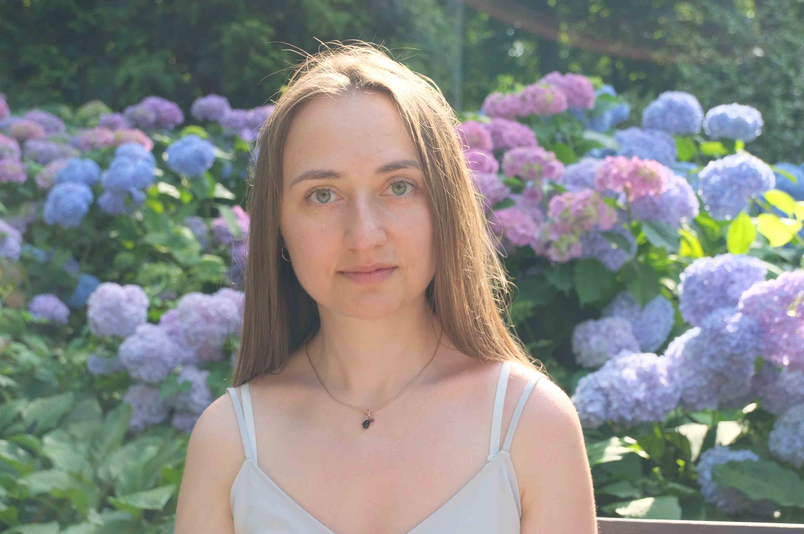

# Ekaterina Lobzova

### Junior Frontend Developer

***********************
# Contact Info

**Location** Moscow, Russia  
**Phone** +79175286633  
**e-mail** k.a.guskova@gmail.com

************************
# Skill

* HTML5, CSS3
* JavaScript Basics
* Git, GitHub
* VS Code
* Atlassian Jira
* Atlassian Confluence
* Basic knowledge of Linux

**************************
# Education
Bauman Moscow State Technical University  
Standardization and metrology  
Moscow  
I received the Magister degree with graduated summa cum laude - 4.9 GPA  

Bauman Moscow State Technical University  
Standardization and metrology  
Moscow  
I received a bachelor's degree in the field of metrology, standardization, and interchangeability. Graduated summa cum laude - 4.5 GPA.While studying at the university, I actively participated in the university scientific and social activities, received achievements scholarships in educational and scientific activities. I have experience speaking at conferences and seminars, including international.

************************
# Experience
1. Federal state unitary enterprise «Russian Research Institute for Metrological Service»  
Moscow  
* Software testing 
* Сoordination of procurement and work with collaborators 
* Performance of work on research and development work and presentation of the results 
* Testing of measuring instruments and reference materials 
* Development and certification of measurement methods 
* Paperwork

2. AO ORS - System Analyst of COMPUTER RESERVATION SYSTEM  
Moscow  

* Analysis information system
* Design information system
* Implementation information system
* Testing information system

# Courses
Databases
[Certificate](https://coursera.org/share/a6bc853afa8ee08be729c4b47429a385)

********************************
# Languages
Russian  
English - B1  
German - A1  
